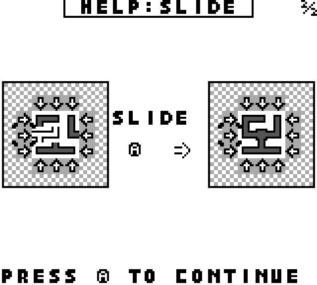
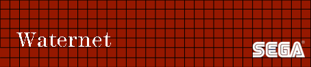
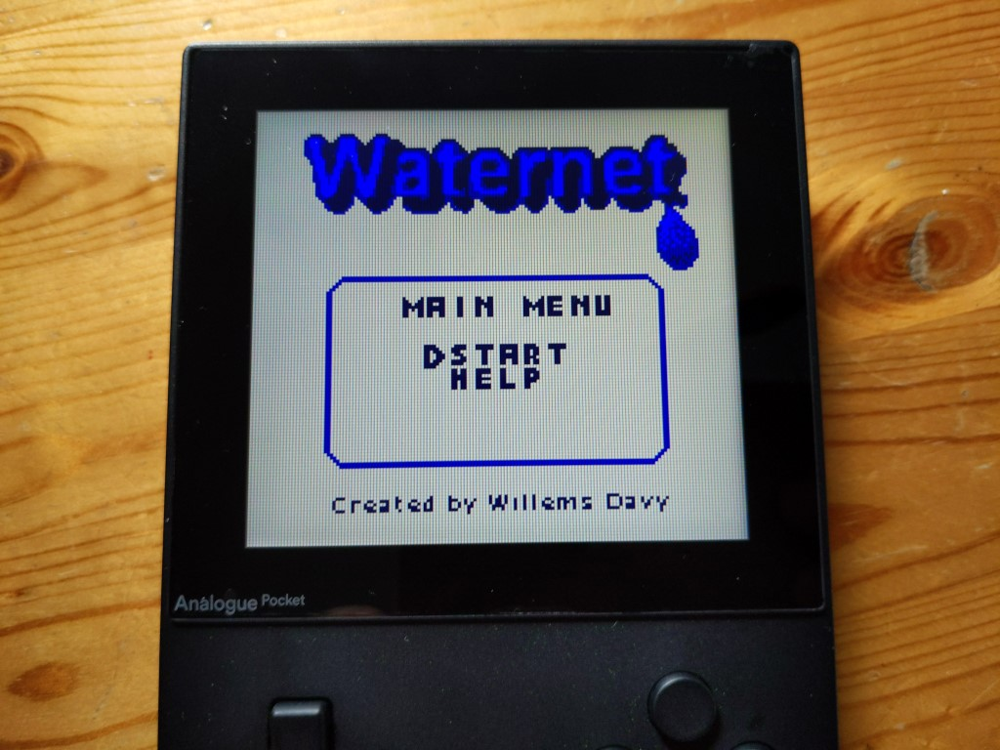

# Waternet Multiplatform Retro Game
Waternet is a multiplatform puzzle game written for old consoles and handhelds like Game Boy (Color), Game Gear, Master System, Analogue Pocket and Mega Duck using the gbdk sdk. 

## Controls

| Button        | Action                                                                   |
|---------------|--------------------------------------------------------------------------|
| A / 1 / Start | Confirm in menu and level selector, rotate or slide action while playing |
| B / 2         | Back in menu, level selector and game                                    |

## Game Modes
The aim of the game, in any game mode is always to connect all pipes so that water can flow through them from the water point source. How you can accomplish this depends on the  game mode. The game as a help section in the main menu where you can always check up on the rules of each game mode.

### Rotate Mode
 You need to connect all the pipes so water flows through them by pressing the A or 1 button (depending on the system) on a pipe to rotate the single pipe.

### Slide Mode
You need to connect all the pipes so water flows through them by pressing the A or 1 button (depending on the system) on the arrows of a row or column. The row or column will move all pipes in the direction the arrow is pointing at.

### Roslid Mode
You need to connect all the pipes so water flows through them by pressing the A or 1 button (depending on the system) on the arrows of a row or column. The row or column will move all pipes in the direction the arrow is pointing at, but you can also press the A or 1 button (depending on the system) on a pipe to rotate the single pipe. It is the Rotate and Slide mode combined into one mode.

### Ingame help slides
||||
|---|---|---|
|  |  |  |

## Graphics 
Graphics (tiles), i created in [Game Boy Tile Designer](http://www.devrs.com/gb/hmgd/gbtd.html) and the titlescreen graphic is based on a modified title screen image from my waternet game i made for [gp2x](https://www.willemssoft.be/index.php?main=5&sub=6&action=productdetails&id=218) and [windows](https://www.willemssoft.be/index.php?main=46&sub=7&action=productdetails&id=220). I designed the title screen in the [Gimp Image Editor](https://www.gimp.org/) to just have the word waternet, the waterdrop and the menu box to fit it all on the Game Boy screen. Afterwards i used [Game Boy Png Converter](https://github.com/gingemonster/GameBoyPngConverter) to convert the titlescreen to an optimized tilemap and tiles. 

## Music
Music was made using [Online Sequencer](https://onlinesequencer.net/), i created single channel, non mixed music files and later converted this music to an array storing the frequencies of notes to be used on the gameboy. I got [this idea](https://www.gamedeveloper.com/programming/making-a-game-boy-game-in-2017-a-quot-sheep-it-up-quot-post-mortem-part-2-2-) from the [sheep it up](https://gamejolt.com/games/sheepitup/267335) game developed by Dr. Ludos. He stored the frequencies to be used for the music notes in a first array, containing the registers for the gameboy for channel 2. Later he referenced this array in another array to create the music itself with these notes. So i used the same system and all i had todo was convert the music from onlinesequencer i made to such array (by hand) as well.or the Sega Hardware (Game Gear, Master System) i did something similar but related to the sound chip used (PSG). I just had to use a different array for the values used for frequencies and create a similar function as the one i used on the Game Boy.

You can find the music files i used for the game below:

* Game Music: [https://onlinesequencer.net/2485064](https://onlinesequencer.net/2485064)
* Title Music: [https://onlinesequencer.net/2484977](https://onlinesequencer.net/2484977)
* Level Done Tune: [https://onlinesequencer.net/2484974](https://onlinesequencer.net/2484974)

## Testing on Real hardware
To test my rom on real hardware i used a flash cartridges like for example the  EZ-Flash Jr for Game Boy (Color). 
It allowed me to put my compiled rom on a sd card and then load that rom from the system itself. 
I'm guessing these flash cardridges flash a certain chip on the fly with the provided rom, but it allowed me to test my game's on a real hardware. 
I highly advise anyone making similar games to do the same as initially everything looked fine on an emulator on pc but as soon as i tested on the real hardware like the original Game Boy i noticed some tiles were not really visible and i had to adapt the tiles i initially created.

## Cartridge Graphics
To create the cartridge graphics i used a [template](https://www.deviantart.com/armando92/art/Label-Template-for-Gameboy-Gameboy-Color-Carts-418758475) made by armando92 to start with in Gimp and then added different pictures i found on [cleanpng](https://www.cleanpng.com) to create the Cartridge Label and the logo i created using a [free logo creator](https://www.flamingtext.com/) site. You can see the end result below. 

### Game Boy (Color) - 4.2 x 3.7 cm.

### Game Gear

### Master System - 10.3  x 2 cm.

## Photo's of the game running on real hardware

### Analogue Pocket (thanks to [bbbbbr](https://github.com/bbbbbr))
 
 

### Game Boy
 

### Game Boy Color (thanks to [SelvinPL](https://github.com/SelvinPL))
 

## Credits
Waternet game concept is based on the Net and Netslide game from the [Simon Tatham's Portable Puzzle Collection](https://www.chiark.greenend.org.uk/~sgtatham/puzzles/),
it's my own implementation of these 2 game concepts

### Tutorials used
* GamingMonsters "How to create a gameboy game" video tutorials on [youtube](https://www.youtube.com/watch?v=HIsWR_jLdwo&list=PLeEj4c2zF7PaFv5MPYhNAkBGrkx4iPGJo&index=1)

### Code Credits
* Fading function for Game Boy Color is based on ZGB's implementation - [https://github.com/Zal0/ZGB](https://github.com/Zal0/ZGB)
* Music [implementation](https://www.gamedeveloper.com/programming/making-a-game-boy-game-in-2017-a-quot-sheep-it-up-quot-post-mortem-part-2-2-) based on system used in the [sheep it up](https://gamejolt.com/games/sheepitup/267335) gameboy game made by Dr. Ludos
* Music on Sega hardwarde wouldn't have been possible without the help from [SelvinPL's Sega Sound example](https://github.com/SelvinPL/SegaSound)

### Cartridge Graphcis used
* [Game Boy Cartridge Template](https://www.deviantart.com/armando92/art/Label-Template-for-Gameboy-Gameboy-Color-Carts-418758475) - armando92
* [Game Gear Cartridge Template](https://www.smspower.org/forums/files/gg_label_design_v10_126.png) - SegaSonicFan Designs
* [Master System Cartridge Template](https://www.deviantart.com/borracho2x/art/Template-Sega-Master-System-805970013) - borracho2x
* [Water droplets](https://www.cleanpng.com/png-circle-graphic-design-brand-pattern-cartoon-fine-d-440349/) - Baure
* [Plumber Guy](https://www.cleanpng.com/png-commercial-cleaning-window-cleaner-maid-service-ja-4614244/) - Endara
* [Plastic Pipes](https://www.cleanpng.com/png-piping-and-plumbing-fitting-plastic-pipework-chlor-5780276/) - Jaumo

### Tools used:
* GBDK 2020 - [https://github.com/Zal0/gbdk-2020/](https://github.com/Zal0/gbdk-2020/) 
* Visual Studio Code - [https://code.visualstudio.com/](https://code.visualstudio.com/)
* BGB - [https://bgb.bircd.org/](https://bgb.bircd.org/)
* Emulicious - [https://emulicious.net/](https://emulicious.net/)
* Game Boy Tile Designer - [http://www.devrs.com/gb/hmgd/gbtd.html](http://www.devrs.com/gb/hmgd/gbtd.html)
* Game Boy Map Builder - [http://www.devrs.com/gb/hmgd/gbmb.html](http://www.devrs.com/gb/hmgd/gbmb.html)
* Game Boy Png Converter - [https://github.com/gingemonster/GameBoyPngConverter](https://github.com/gingemonster/GameBoyPngConverter)
* Gimp Image Editor - [https://www.gimp.org/](https://www.gimp.org/)
* Online Sequencer - [https://onlinesequencer.net/](https://onlinesequencer.net/)
* Music notes to Game Boy Frequencies chart - [http://www.devrs.com/gb/files/sndtab.html](http://www.devrs.com/gb/files/sndtab.html)
